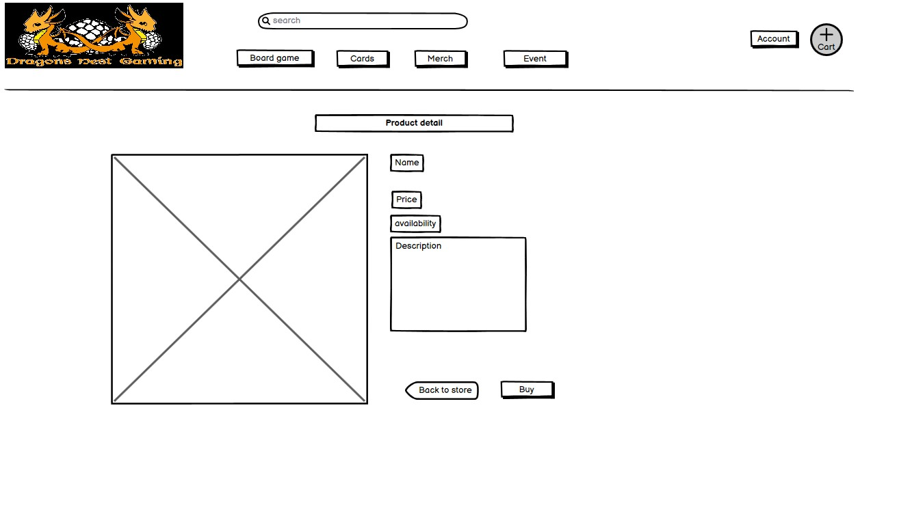

# Dragons Nest Gaming

Live App link : [Dragons Nest Gaming](https://dngshop.herokuapp.com/)
Git Hub Repository : [Dragons Nest Gaming](https://gurranasan-dragonsnestg-ojigzz9jbaa.ws-eu90.gitpod.io/)

Dragons Nest Gaming is a gamingstore in Norway I started together with my brothers. It started with my biggest brother who
sold Magic the Gathering cards on auction sites. All went well and they saw the intresset in the market in Stavanger there we lived and we started a pysical store there like minded could meet up. The store goes well and we sell some stuff through Facebook. But it is time for a E-commerce webpage so we can reach a bigger clientele. It is a business site that sells products to private custumers and it is singel payment. 

* Key featueres Include:
  - search and filters: User can search and filter products to easy find what they want.
  - Real-time availability: User can see if products is in stock and how many.
  - Cart & Stripe checkout: Users can add multiple products in there cart, see a total and then go to checkout with stripe. See [Stripes testing card details](https://stripe.com/docs/testing?testing-method=card-numbers#visa) to place an order on the website.
  - Ratings: A signd in user can leave rating and/or review on the products.
  - Authentication: User can create a account to save shipping details and leave reviews.
  - Event Calendar: A calender for the users to see if there are any Events going on in the store.

## Contents

+ [User Experience(UX)](#user-experience-ux)
     + [Color Scheme](#color-scheme)
     + [Icons](#icons)
     + [Wireframes](#wireframe)
 + [Agile Method](#agile-method)
      + [User Stories](#user-stories "User Stories")
      + [Data modal](#data-modal)
      + [Future Features](#future-features)
+ [Margeting](#margeting)
    + [E-Commerce Application](#E-Commerce-Application)
    + [Marketing Strategy](#Marketing-Strategy)
    + [Search Engine Optimization](#search-engine-optimization)
    + [XML Sitemap](#XML-sitemap)
+ [Page Features](#page-features)
   + [nav bar](#nav-bar)
   + [Index](#index-page)
   + [Shop](#shop)
      + [Products](#products)
      + [Cart](#cart)
      + [Checkout](#checkout)
      + [Confirmation](#confirmation)  
   + [Event](#forum)
      + [Calendar](#calendar)
      + [Event detail](#event-details)
   + [Profile](#profile)
      + [My profile](#my-profile)
      + [Add Review](#add-review)  
   + [Admin](#radmin)
      + [Manage products](#manage-products)
      + [Manage event](#Manage-event)
   
+ [Technologies](#Technologies)
   + [Programming Languages](#programming-languages)
   + [Support Programs & libraries](#support-programs-libraries)

+ [Testing](#Testing)
    + [Bugs](#bugs)
    + [ManuelTesting](#manuel-testing)
    + [NavigationHeader](#navigation-header)
    + [PageManualTesting](#home-page-maual-testing)
    + [Index page](#testing-index-page)
    + [SignInManualTesting](#sign-in-manual-testing)
    + [Shop](#teseting-forum)  
        + [Products](#category-page-testing)
        + [Cart](#cart-testing)
        + [Checkout](#checkout-testing)
        + [Confirmation](#confirmation-testing) 
    + [Calender](#teseting-forum)  
        + [Calender](#calender-testing)
        + [add/edit event](#add/edit-testingt)
    + [Profile](#profile-testing)  
        + [profile info](#profile-info-testing)
        + [add/edit rating](#add/edit-rating)             
    + [Validation](#Validation)
        + [HTML](#html)
        + [CSS](#css)
        + [Python](#python)
        + [Javascrip](#javascript)
        + [Lighthouse](#lighthouse)
   
+ [Deployment](#deployment)
   + [Github](#github)
   + [Gitpod and Django](#gitpod-and-django)
   + [Heroku](#heroku)   
   
+ [Acknowledgments](#acknowledgments)
    + [Credits](#credits)
    + [Copied Code](#copied-code)

### User Experience UX
  
  The plan for the site was to build a slim site that was easy for users to use and find what thay want. I also wanted to build a event calendar for the users that live close to the store so they could meet up. 
  The font name for the page is: K2D a slim but easy to read. 
  
#### Color Scheme

I choose to use limited color scheme of Orange #f29100, Black and White. I got the Orange color from the logo 
so it feels like everyting fits in. And with Black and white it is easy to make contrast. 

In some placees i used Green for succes/Add, Red for warning/delete to get a more user friendly experience.

#### Icons
I used icons from Font Awsome extensivley on the website. They are used within the nav bar to reduce the need for verbose descriptions such as 'search. I have used them on buttons to reinforce the action of the button.

#### Wireframes

When I started the project I made up some wire frames to the core structure for the page. 

This is for the Homepage/Index page I wanted it to be slim with not that much text. But easy nav menu so the user could find what they wanted fast. I also draw up 
an idea for the footer. But as you can see i did some changes,i moved down the nav menu abit and rearranged the footer. But the original content is there. 

This was my idea for the product page, where you could see and filter the products. I change so there was only 3 products in a row. I also added a in stuck icon so the user could see if there was in stock.

For the product details page i moved around the content to, I felt there was better to have the put in bvag button over the description so it would be easyer to press
if the description was long. I also added a average rating so user could now what other thinhgs and a carousel for reviews if there is any. 

The final cart page looks like the origninal idea. 
  
### Agile Method 

I used the github projects as a agile tool to manage the planning and implamentation of functions to the site. 
[Project Board](https://github.com/users/GurraNasan/projects/6)

#### User Stories
  Before I started to code a took a meeting with my brothers to tall about what they wanted on the site and we put up some user-stories and prioritized using MoSCoW. This is the user stories:
  + [USER STORY: Manage products](https://github.com/GurraNasan/dragons-nest-gaming/issues/1)
  + [USER STORY: Event handling](https://github.com/GurraNasan/dragons-nest-gaming/issues/2)
  + [USER STORY: Send newsletter](https://github.com/GurraNasan/dragons-nest-gaming/issues/3)
  + [USER STORY: Moderate ratings](https://github.com/GurraNasan/dragons-nest-gaming/issues/4)
  + [USER STORY: See products](https://github.com/GurraNasan/dragons-nest-gaming/issues/5)
  + [USER STORY: Product details](https://github.com/GurraNasan/dragons-nest-gaming/issues/6)
  + [USER STORY: Find offers](https://github.com/GurraNasan/dragons-nest-gaming/issues/7)
  + [USER STORY: See new products](https://github.com/GurraNasan/dragons-nest-gaming/issues/8)
  + [USER STORY: Cart total](https://github.com/GurraNasan/dragons-nest-gaming/issues/9)
  + [USER STORY: Search product](https://github.com/GurraNasan/dragons-nest-gaming/issues/10)
  + [USER STORY: Shopping cart](https://github.com/GurraNasan/dragons-nest-gaming/issues/11)
  + [USER STORY: See event calendar](https://github.com/GurraNasan/dragons-nest-gaming/issues/12)
  + [USER STORY: Register user](https://github.com/GurraNasan/dragons-nest-gaming/issues/13)
  + [USER STORY: Recover password](https://github.com/GurraNasan/dragons-nest-gaming/issues/14)
  + [USER STORY: View user profile](https://github.com/GurraNasan/dragons-nest-gaming/issues/15)
  + [USER STORY: Log in/out](https://github.com/GurraNasan/dragons-nest-gaming/issues/16)
  + [USER STORY: Rate product](https://github.com/GurraNasan/dragons-nest-gaming/issues/17)
  + [USER STORY: Sign up newsletter](https://github.com/GurraNasan/dragons-nest-gaming/issues/18)
  + [USER STORY: View cart](https://github.com/GurraNasan/dragons-nest-gaming/issues/19)
  + [USER STORY: Cart quantity](https://github.com/GurraNasan/dragons-nest-gaming/issues/20)
  + [USER STORY: Payment information](https://github.com/GurraNasan/dragons-nest-gaming/issues/21)
  + [USER STORY: Order confirmation](https://github.com/GurraNasan/dragons-nest-gaming/issues/21)
  + [USER STORY: Confirmation email](https://github.com/GurraNasan/dragons-nest-gaming/issues/21)
  + [USER STORY: One product in many categories](https://github.com/GurraNasan/dragons-nest-gaming/issues/21)
    
#### Future Features

I got two user storie left, that I did not have time to implant. The most importent one is that one product can be seen in many categories, this will help them be more exposed on the site. 
One other big feature is to add a wishlist for the Users. 
I want to expand the calander function to be a better layout and have abit better style.

### Margeting

#### E-Commerce Application

Dragons Nest Gaming is a small business and with a E-commerce Application it can expand to reach more customers. The store is selling directly to consumers and the site is designed to sell quickly. Thats why lots of the functions is focused on the user experience.

#### Marketing Strategy 
Dragons nest gaming is not that big yet and the marketing budget is limited. But there is some ways to reach out to customers and driv traffic to the site and the store. One is with Facebook, the store is activ with new content everyday and tell the customers what is happening. And then we have had some collaborations with local brands like LERVIG a beer company.

#### XML Sitemap
Additionally to help the search engines crawl the website, I've added an XML sitemap file to the main root directory. The file was created using the free service through XML-Sitemaps.com. A sitemap is a way of organizing a website, identifying the URLs and the data under each section. Previously, the sitemaps were primarily geared for the users of the website. However, Google's XML format was designed for the search engines, allowing them to find the data faster and more efficiently.

A robots.txt file has also be included in the build to tell the search engine crawlers which URLs the crawler can access on this site. This is used mainly to avoid overloading the site with requests.

Take a look a the [page](https://www.facebook.com/DragonsNestGaming/)

#### Search Engine Optimization

SEO research is the key to get traffic to the site. 

 

I set up a couple of categories and find word to them and the researched the word to meet the compitions for everyone. 
The words i came up with was: "magic the gathering, board game, pokemon, Norway, gamesworkshop, game webstore wpn-store.
To improve the search engine ranking I ensured the site carries meta tags for a description and keywords which encapsulate the general content.

### Page Features 
   #### Nav Bar
   
   
   Here you can see the logo and name of the sore, find a search bar, the diffrent product categories, my account and the cart. You can see the value of the cart if      you have something in it. 
   
   #### Footer
   
   In the footer you can see openinghours, diffrent policies, links to social media and sign up for newsletter
   
   #### Index
   
   
   
   There is not alot of content here, but there is SEO Keywords in the text and a button to start shopping.
   
   #### Shop
   ##### Products
   
   
   
   Here we can see all the products with price, rating, instock symbol, new/deal tag and name. You can filter after price or name. And    see how many products there is.  
   
   
   
   On this page you get the description for the product, name, price, rating and reviews if there is one. You can put the product in your cart or go back to the store. If you are admin you get buttons for delete or Edit the product. 
   
   ##### Cart
   
   
   Here you can see what you have in you cart and see the total and delivery cost. From here you can go to the checkout.
   If you want you can change the quantity or remove products from the cart.
   
   ##### Checkout
   
   
   
   On the check out page you can fill in you shipping address and card credentiel. You can save you info if you are logged in. 
   
   ##### Confirmation 
   
   
   
   Here you can see your order information and the total value. You get a pop up that says it it successfull too.
   
   #### Event
   
   ##### Calendar 
   
   
    Here you can see a calendar and events on the diffrent days, You can press the events to get more details. As a admin you can add events. 
    
   ##### Event detail
   
   Here you can see more details and a picture for the event
   
   #### Profile
   ##### My profile
   
   
   
   On this page you can see you order history, billing information and you can go to your reviews.
   
   ##### Review  
   
   
   
   As a site uesr you can rate and give reviewvs to products. 
   
   #### Admin
   ##### Add products
   
   
   As a Admin you can login and add products to the site
   
   #### Errors
   ##### 404
   
   
   If the page cant be found you get a page 404. 
   
### Technologies
#### Programming Languages
   + [HTML5](https://en.wikipedia.org/wiki/HTML5)
   + [CSS3](https://en.wikipedia.org/wiki/Cascading_Style_Sheets)
   + [Javascript](https://en.wikipedia.org/wiki/JavaScript)
   + [Python](https://www.python.org/)

#### Support Programs & libraries
+ [Git](https://git-scm.com/)
    - Version control.
+ [GitHub](https://github.com/)
    - For storing code and deploying the site.
+ [Gitpod](https://www.gitpod.io/)
    - Used for building and editing my code.
+ [Django](https://www.djangoproject.com/)
    - A python based framework that was used to develop the site.
+ [Bootstrap](https://getbootstrap.com/)
    - For help designing the html templates.
+ [Google Fonts](https://fonts.google.com/)
    - Used to add style the website's font.
+ [Font Awesome](https://fontawesome.com/)
    - Used to obtain the icons used.
+ [Favicon.io](https://favicon.io/emoji-favicons/amphora/)
    - Used to generate the site's favicon.   
+ [Google Developer Tools](https://developers.google.com/web/tools/chrome-devtools)
    - Used to help fix problem areas and identify bugs.
+ [AWS](http://aws.amazon.com/)
    - Used to store static files and images.
+ [ElephantSQL](https://www.elephantsql.com/)
    - Storage for the database
+ [W3C Markup Validation Service](https://validator.w3.org/) 
    - Used to validate HTML code.
+ [W3C CSS Validation Service](https://jigsaw.w3.org/css-validator/#validate_by_input)
    - Used to validate CSS code.
+ [Pep8ci](https://pep8ci.herokuapp.com/) - Thank you Code Institute
    - Used to validate Python code found on slack #announcements
+ [JSHint](https://jshint.com/)
    - Used to validate JS code.
+ [Heroku](https://www.heroku.com/)
    - To deploy the project.
+ [Stripe](https://stripe.com/gb)
    - Stripe is used to handle website payments.

### Testing 
I utilised a manual testing strategy for the development of the site. 
#### Bugs 

##### Fixed
Many bugs came up with typos, like i put a s in item. 
I forgot the table end tag on the calendar so it was always at the bottom and under the footer. 
I haved changed the name and friendly name on a category so it did not show up. It was easy to change back. 
##### Need to be fixed
At the rating page you can write a larger number then 5, but you get a error message. The limit it 5, so you cant send it. 
Back to top button always shows.
Wrong time format when you add to calendar, should be 24hours

#### ManuelTesting

##### Nav Bar
- The main navigation buttons have been tested and prove to work
- User permission have been tested and proven to work
- The logo take you to homepage and it works. 

##### Footer
-All links open in a new tab
-Policies take you to the right place
The footer render as intended

##### Index-page
- The button has been tested and worked

#### SignInManualTesting
- Register, log in and log out pages render as expected
- Test the form fields in registration and it works
- Recover password works
- Non-authenticated users cannot access user profile, they are redirected to log in

##### Shop
##### Products
- Filters have been tested and proven to work as desired
- Links have been tested and proven to work
- New/deal are tested and prove to work
- Rating only shows if there is any and it shows the right value
- No image render at intended
- In product details the reviews only shows if there is any as intended
- The quantity buttons works as intented, you cant add more and there is. 
- If product is out of stock you can not add it to the bag

##### Cart
- Cart renders as expected with one or more products added to cart 
- Buttons have been tested and proven to work
- Cart renders as expected with no items in cart
- Items can be removed from the cart
- If quantity sets to 0 the items will be removed, works as intended

##### Checkout
- Cart renders as expected
- Signed in user can save information to profile
- Invalid card details error messages appear

##### Confirmation
- Order success page renders as expected

##### Calender]
-Calendar render as expected
- Buttons works as intended
- Link to event works as it should
- 
##### Profile
- User profile renders as expected
- Links are tested and proven to work
- Users can update their information from the form.
- Only register user can go to profile or you get send back to login
            
 ### Validation
 #### HTML 
 
 No errors
 
 #### CSS
 
 No Error
 
 #### Python]
  
 All Custom Python & JavaScript code was manually tested multiple times during and after development. Used autopep8
 to format the code
 
 #### Javascrip
 
 Stripe
 
 Quantity
 #### Lighthouse
 
 Homepage
 
 Products
 
 For the cart
 
   
## Deployment
I used github and heroku to deply this project

### Github

+ First you need to start a new repository.
+ Logg in to Github.
+ Press the blue book icon.
+ Choose a template, i use the code institute template as recommended.
+ Add repository name and press create repository in the bottom of the page.
+ Then press the gitpod button.

### Gitpod and Django

+ Here you install django with pip install Django
+ Install other Libraries you need
+ Write your code
+ Dont forget to make a env file for sensitiv data and write it in the .gitignore file so you dont send it to the public. 
+ You also need to make a requirements.txt file. Use: pip3 -freeze-- local > requirements.txt
+ Make a Procfil

### Heroku

+ Logg in to heroku
+ Press the new button and then new app
+ Choose uniquely app name and region and click creat app
+ Go to settings and reveal config var, here you write in all the sensetiv data, address to database and other urls you use in the project.
+ Go back at the top and click on "Deploy" and select "GitHub".
+ Scroll down and click on 'Connect to GitHub'.
+ Search for your GitHub repository name by typing it.
+ Click on "Connect".
+ Scroll down and click on "Deploy Branch".
+ You will see a message "The app was successfully deployed" when the app is built with python and all the depencencies.
+ Click on view and you will see the [deployed site](https://dngshop.herokuapp.com/).
   
## Acknowledgments
### Credits
To fellow students on Slack for inspiration and help when i was stuck.
[https://stackoverflow.com/](https://stackoverflow.com/) For all the threats and help. 
Code Institute lesson videos, many hourse going back and forward.
My Brothers for the ideas and feedback and all the pictures. 
Hui Wen for the calendar

### Copied Code
Code Institutes walkthrough: Boutiq ado paid a big part in the structure of my App as well as certain parts that are directly used and referred to in the code via comments.
Borrowed some code from [ui wen](tps://github.com/huiwenhw/django-calendar)
